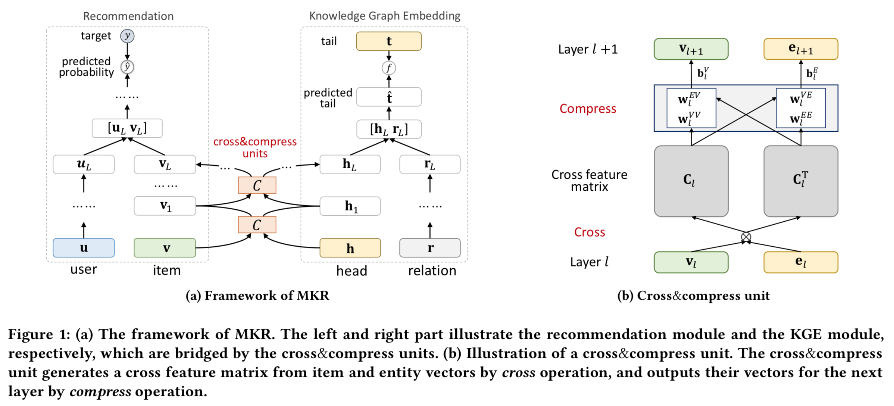

# MKR.PyTorch

This repository is a PyTorch implementation of MKR ([arXiv](https://arxiv.org/abs/1901.08907)).

The code is heavily based on the original [TensorFlow version](https://github.com/hwwang55/MKR).



### Requirements
Tested under
- Python == 3.6
- PyTorch >= 0.4
- scikit-learn, tqdm, numpy, matplotlib, tensorboardX

### Running the code
Preprocess
```
python src/preprocess.py --dataset movie    # for MovieLens-1M dataset
python src/preprocess.py --dataset book     # for Book-Crossing dataset    
python src/preprocess.py --dataset music    # for Last.FM dataset  
```
Train and evaluate
- In src/main.py:
  - Uncomment the code blocks of settings for specific dataset
  - Comment the others you don't need
```
$ python src/main.py
```
